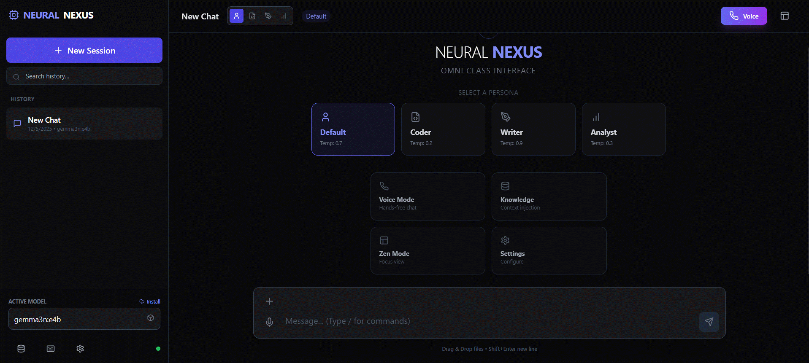

# Neural Nexus UI

A modern, feature-rich chat interface for [Ollama](https://ollama.ai) and [Groq](https://groq.com) - run AI models locally or blazing-fast in the cloud.

    



## ✨ Features

### 🆕 New in v1.2.0
- **🤖 Multi-Agent Peer Review** - Three AI agents collaborate: Expert writes, Adversary reviews, Refiner corrects
- **🐍 Python Validation (Pyodide)** - Validate Python code in AI responses using WebAssembly
- **🧪 Code Syntax Checking** - Automatic syntax validation for Python and JavaScript code blocks
- **👥 Agent Configuration** - Configure different models for each agent role
- **🔄 Smart Model Filtering** - Automatically filters out embedding-only models from chat selection

### Core Features
- **🚀 Dual Provider Support** - Ollama (local) and Groq (cloud) with seamless switching
- **⚡ Groq Integration** - Blazing-fast cloud inference (100-500+ tokens/sec) with Llama 4, Qwen 3, and more
- **🎨 Light & Dark Themes** - Professional color palette with system preference detection
- **🧠 Neurosymbolic AI Search** - Hybrid search combining neural embeddings with symbolic reasoning
- **⚡ Persistent Embedding Cache** - Embeddings saved to IndexedDB for instant RAG on page reload
- **🗣️ Voice Mode** - Hands-free conversation with speech recognition and text-to-speech
- **🔧 Tool Calling** - AI can use tools for calculations, web search, RAG, and more
- **🔍 Tavily Search** - AI-powered web search with direct answers (API key required)
- **📄 Tavily Extract** - AI-powered content extraction from web pages (cleaner than basic fetch)
- **📊 Knowledge Graph** - Automatic entity extraction and relation building
- **📚 Knowledge Base** - Upload files, fetch URLs, or paste text for context
- **🎭 Personas** - Switch between chat modes (Default, Coder, Writer, Analyst)
- **🧘 Zen Mode** - Distraction-free, minimal interface
- **⚙️ Advanced Settings** - Full control over model parameters (temperature, top_k, top_p, etc.)
- **🔢 Embedding Model Selection** - Choose from available Ollama embedding models
- **💾 Session Management** - Multiple chat sessions with auto-save using IndexedDB
- **📎 File Attachments** - Upload images, code files, and documents
- **📄 Document Processing** - Extract text from PDF, Word (.docx), Excel, and more
- **⌨️ Keyboard Shortcuts** - Power user friendly
- **🔄 Streaming Responses** - Real-time token streaming

## 🚀 Quick Start

### Prerequisites

- [Node.js](https://nodejs.org/) 18+ (or use conda with nodejs)
- [Ollama](https://ollama.ai) running locally

### Installation

```bash
# Clone the repository
git clone https://github.com/ahjavid/neural-nexus-ui.git
cd neural-nexus-ui

# Install dependencies
npm install

# Start development server
npm run dev
```

Open [http://localhost:3000](http://localhost:3000) in your browser.

### Using Conda (Alternative)

```bash
# Create conda environment
conda create -n neural-nexus-ui nodejs=20 -y
conda activate neural-nexus-ui

# Install and run
npm install
npm run dev
```

## 🛠️ Configuration

### Ollama Setup (Local)

Make sure Ollama is running:

```bash
ollama serve
```

Pull a model:

```bash
ollama pull llama3.2
# or
ollama pull deepseek-r1:8b
```

The UI will auto-detect available models.

### Groq Setup (Cloud)

For blazing-fast cloud inference (100-500+ tokens/sec):

1. Get a free API key at [console.groq.com](https://console.groq.com)
2. Open **Settings** (`Ctrl/Cmd + ,`)
3. Switch to **Groq** provider tab
4. Enter your API key and click **Test**
5. Select from available models (Llama 4, Qwen 3, etc.)

### Environment

| Provider | Endpoint | Notes |
|----------|----------|-------|
| **Ollama** | `http://localhost:11434` | Local, configurable in Settings |
| **Groq** | `https://api.groq.com/openai/v1` | Cloud, requires API key |

## 🎨 Themes

Neural Nexus supports three theme modes:

| Mode | Description |
|------|-------------|
| **Dark** | Default dark theme with blue accents |
| **Light** | Professional light theme with proper contrast |
| **System** | Follows your OS preference |

Toggle themes using the sun/moon button in the header.

## ⌨️ Keyboard Shortcuts

| Shortcut | Action |
|----------|--------|
| `Ctrl/Cmd + K` | New chat |
| `Ctrl/Cmd + B` | Toggle sidebar |
| `Ctrl/Cmd + ,` | Open settings |
| `Ctrl/Cmd + /` | Toggle Zen mode |
| `Enter` | Send message |
| `Shift + Enter` | New line |

## 🎭 Personas

- **Default** - Balanced, general-purpose assistant
- **Coder** - Technical expert for programming tasks
- **Writer** - Creative writing and content assistance
- **Analyst** - Data analysis and structured insights

## 📁 Project Structure

```
neural-nexus-ui/
├── src/
│   ├── components/       # React components (TypeScript)
│   │   ├── Button.tsx
│   │   ├── ChatInput.tsx
│   │   ├── ChatMessage.tsx
│   │   ├── CodeBlock.tsx
│   │   ├── HelpModal.tsx
│   │   ├── KnowledgeBaseModal.tsx
│   │   ├── MessageContent.tsx
│   │   ├── ModelManagerModal.tsx
│   │   ├── PersonaSelector.tsx
│   │   ├── SettingsModal.tsx
│   │   ├── Sidebar.tsx
│   │   ├── Tooltip.tsx
│   │   ├── VoiceModeOverlay.tsx
│   │   ├── WelcomeScreen.tsx
│   │   └── index.ts
│   ├── contexts/         # React contexts
│   │   └── ThemeContext.tsx
│   ├── utils/            # Utility functions
│   │   ├── agentic.ts    # Multi-agent peer review system
│   │   ├── documents.ts  # PDF/Word/Excel processing + chunking
│   │   ├── groq.ts       # Groq API via official groq-sdk (streaming, models)
│   │   ├── helpers.ts    # Formatting helpers
│   │   ├── neurosymbolic.ts # Neurosymbolic AI (entity extraction, knowledge graph, hybrid search)
│   │   ├── pyodide.ts    # Python validation via WebAssembly (Pyodide)
│   │   ├── storage.ts    # IndexedDB manager
│   │   ├── tools.ts      # Tool registry and handlers
│   │   └── index.ts
│   ├── types/            # TypeScript types
│   │   ├── index.ts      # Core type definitions
│   │   └── speech.d.ts   # Web Speech API types
│   ├── __tests__/        # Test files
│   │   ├── Button.test.tsx
│   │   ├── helpers.test.ts
│   │   ├── HelpModal.test.tsx
│   │   └── setup.ts
│   ├── App.tsx           # Main application component
│   ├── main.tsx          # React entry point
│   ├── vite-env.d.ts     # Vite type declarations
│   └── index.css         # Global styles & Tailwind
├── assets/               # Screenshots and media
├── index.html            # HTML template
├── tsconfig.json         # TypeScript configuration
├── tsconfig.node.json    # Node TypeScript config
├── vitest.config.ts      # Test configuration
├── vite.config.js        # Vite configuration (includes proxy)
├── tailwind.config.cjs   # Tailwind configuration
├── postcss.config.cjs    # PostCSS configuration
└── package.json          # Dependencies & scripts
```

## 🧪 Development

### Available Scripts

```bash
# Start development server
npm run dev

# Run tests
npm test

# Run tests with UI
npm run test:ui

# Run tests with coverage
npm run test:coverage

# Type check
npm run typecheck

# Build for production
npm run build

# Preview production build
npm run preview
```

## 🔧 Advanced Model Parameters

Access these in Settings → Advanced:

| Parameter | Description | Default | Groq Support |
|-----------|-------------|---------|---------------|
| Temperature | Creativity (0-2) | 0.7 | ✅ |
| Top K | Token selection pool | 40 | ❌ Ollama only |
| Top P | Nucleus sampling | 0.9 | ✅ |
| Repeat Penalty | Reduce repetition | 1.1 | ❌ Ollama only |
| Context Length | Token memory | 4096 | ❌ Ollama only |
| Max Tokens | Response length | 2048 | ✅ |
| Mirostat | Perplexity control | Off | ❌ Ollama only |
| Seed | Deterministic output | - | ✅ |
| Stop Sequences | Stop generation | - | ✅ |

> **Note:** When using Groq, only supported parameters are sent. Ollama-specific parameters are ignored.

## 🧠 Memory & Context

### How Context Works

- **Session Memory** - Each chat session maintains full conversation history
- **Context Window** - Limited by `num_ctx` parameter (default: 4096 tokens)
- **Knowledge Base** - Inject persistent context across conversations
- **System Prompts** - Persona-specific instructions sent with each request

### Context Tips

- Use **Knowledge Base** for information you want available across all chats
- Increase `num_ctx` in Advanced Settings for longer conversations (uses more VRAM)
- Start a **New Chat** when switching topics to avoid context pollution
- The model receives: `System Prompt + Knowledge Base + Full Chat History + Your Message`

### Storage

- Sessions are saved to **IndexedDB** (virtually unlimited storage, browser-managed)
- Knowledge Base entries are stored in IndexedDB
- No server-side storage - everything stays local
- Auto-migrates from localStorage to IndexedDB on first load

## 📄 Document Processing

Neural Nexus can extract text from various document formats for AI analysis:

| Format | Extensions | Processing | Max Size |
|--------|------------|------------|----------|
| **PDF** | `.pdf` | Text extraction from all pages | 100MB |
| **Word** | `.docx`, `.doc` | Full text extraction | 100MB |
| **Excel** | `.xlsx`, `.xls` | CSV conversion per sheet | 100MB |
| **Text/Code** | `.txt`, `.md`, `.json`, `.csv`, `.xml`, `.html`, `.js`, `.ts`, `.py`, `.yaml` | Direct text | 25MB |
| **Images** | `.png`, `.jpg`, `.gif`, `.webp` | Sent to multimodal models | 50MB |

### How Document Processing Works

1. **CPU-based extraction** - Documents are processed in your browser using JavaScript libraries
2. **Automatic chunking** - Large documents are split into ~1000 char chunks with 200 char overlap
3. **Text injection** - Extracted text is injected into the prompt for the LLM
4. **No external services** - All processing happens locally, your documents never leave your machine

### Supported Libraries

- **PDF.js** - Mozilla's PDF rendering library
- **Mammoth** - Word document text extraction
- **SheetJS (xlsx)** - Excel spreadsheet parsing

## 📚 Knowledge Base

The Knowledge Base allows you to add persistent context that can be:
1. **Injected into conversations** - Check entries to include them in system prompt
2. **Searched semantically** - Use RAG search to find relevant content
3. **Analyzed with Neurosymbolic AI** - Automatic entity extraction and knowledge graph

### Adding Content

| Method | Description |
|--------|-------------|
| **Text** | Paste text directly with a title |
| **File Upload** | Upload PDF, DOCX, TXT, MD, JSON, CSV, and more |
| **URL** | Fetch and extract content from any web page |

### Document Chunking

Large documents are automatically split for better RAG retrieval:
- **Chunk size**: ~1000 characters
- **Overlap**: 200 characters (maintains context continuity)
- **Sentence-aware**: Won't cut in the middle of sentences
- **Entity extraction**: Each chunk is analyzed for entities and keywords

## 🧠 Neurosymbolic AI Search

Neural Nexus uses a **hybrid neurosymbolic approach** that combines:
- **Neural**: Embedding-based semantic similarity (like traditional RAG)
- **Symbolic**: Entity extraction, keyword matching, and knowledge graph relations

### How It Works

```
Query → [Neural Embedding] + [Entity Extraction] + [Keyword Analysis]
                ↓                    ↓                     ↓
        Vector Similarity    Entity Matching      Keyword Overlap
                ↓                    ↓                     ↓
                └──────────→ Hybrid Score ←───────────────┘
                                  ↓
                          Ranked Results with Explanations
```

### Entity Types Detected

| Type | Examples |
|------|----------|
| **Dates** | `2024-01-15`, `January 15th, 2024`, `01/15/24` |
| **Times** | `3:30 PM`, `15:30`, `3:30:00` |
| **Money** | `$1,234.56`, `€500`, `£99.99` |
| **Percentages** | `15%`, `3.5%` |
| **Emails** | `user@example.com` |
| **Phones** | `(555) 123-4567`, `+1-555-123-4567` |
| **URLs** | `https://example.com/page` |
| **Numbers** | `1,234,567`, `3.14159` |
| **Durations** | `5 minutes`, `3 hours`, `2 weeks` |

### Knowledge Graph

When documents are added, Neural Nexus automatically:
1. **Extracts entities** from each chunk
2. **Identifies keywords** using TF-IDF-like scoring
3. **Builds relations** between chunks sharing entities or topics
4. **Indexes everything** for fast lookup

### Hybrid Search Weights

The search combines multiple signals with configurable weights:

| Signal | Default Weight | Description |
|--------|---------------|-------------|
| **Semantic** | 45% | Embedding cosine similarity |
| **Entity** | 30% | Matching dates, amounts, emails, etc. |
| **Keyword** | 15% | Shared keyword overlap |
| **Graph** | 10% | Connected nodes in knowledge graph |

### Query Decomposition

Complex queries are automatically decomposed:

| Query Type | Example | Handling |
|------------|---------|----------|
| **Comparison** | "Compare January to February expenses" | Split into sub-queries |
| **Temporal** | "Find receipts before March 2024" | Extract date constraints |
| **Aggregation** | "Total amount of all invoices" | Search + aggregate |

### Reasoning Chains

Enable `show_reasoning: true` to see step-by-step explanations:

```
1. 🔍 PARSE: Extract entities (date: "January", money: "$500")
2. 📚 SEARCH: Found 5 documents using hybrid search
3. 🔬 FILTER: Applied entity constraints
4. 💡 INFER: Connected via knowledge graph relations
```

### Using Neurosymbolic Search

The AI automatically uses neurosymbolic search when you ask about your documents:

```
"Find my expenses from January"
"Show receipts with amounts over $100"
"Compare the two project proposals"
"What invoices mention Amazon?"
```

### Viewing Entity Analysis

In the Knowledge Base modal:
1. Click **"Show analysis"** on any entry
2. View extracted **entities** (color-coded by type)
3. See detected **keywords**

## 🔧 Tool Calling (Function Calling)

Neural Nexus supports Ollama's tool calling feature, allowing the AI to use tools for enhanced capabilities.

> **Note:** Tool calling is only available with **Ollama** models. Groq tool calling is disabled due to model limitations with function call formatting.

### Enabling Tools

1. Open **Settings** (`Ctrl/Cmd + ,`)
2. Click **"Show Tools (Function Calling)"**
3. Toggle **"Enable Tool Calling"** on
4. Optionally enable/disable individual tools

### Built-in Tools

| Tool | Description | Example Use |
|------|-------------|-------------|
| `get_current_time` | Get current date/time with timezone support | "What time is it in Tokyo?" |
| `calculate` | Mathematical calculations | "What is 15% of 250?" |
| `random_number` | Generate random numbers | "Give me a random number between 1 and 100" |
| `web_search` | Search using DuckDuckGo Instant Answers | "Define machine learning" |
| `tavily_extract` | AI-powered content extraction from URLs | "Read this article: https://example.com/post" |
| `rag_search` | Neurosymbolic search through Knowledge Base | "Find info about authentication in my docs" |
| `fetch_url` | Fetch content from a specific URL | "Fetch the content from https://example.com" |
| `encode_text` | Base64/URL encoding/decoding | "Encode this text to base64" |
| `generate_uuid` | Generate UUIDs | "Generate a UUID for me" |
| `text_stats` | Text analysis (word count, etc.) | "How many words are in this paragraph?" |

### Tavily Search (AI-Powered Web Search)

For high-quality, up-to-date web search results:

1. Get a free API key at [tavily.com](https://tavily.com)
2. Open **Settings** → **Show Tools** → **Tool Configuration**
3. Enter your Tavily API key
4. Ask questions about current events, product specs, news, etc.

### Tavily Extract (AI-Powered Content Extraction)

Extract clean, structured content from web pages:

- **Better than basic fetch** - Removes ads, navigation, clutter
- **Markdown output** - Returns content in clean markdown format
- **Batch support** - Extract from up to 20 URLs at once
- **Depth options** - `basic` (fast) or `advanced` (higher success rate)

**Example uses:**
- "Read this article and summarize it: https://example.com/blog/post"
- "Extract the main content from these docs pages"

*Requires Tavily API key (same key as Tavily Search)*

### RAG Search (Neurosymbolic Document Search)

Search your Knowledge Base using hybrid AI:

1. Add documents to Knowledge Base (upload files, fetch URLs, or paste text)
2. Configure embedding model in Settings (default: `mxbai-embed-large:latest`)
3. Ask the AI to search your documents
4. Returns results ranked by semantic similarity + entity matching + keyword overlap

**Features:**
- **Hybrid scoring** - Combines neural embeddings with symbolic entity/keyword matching
- **Entity extraction** - Automatically detects dates, amounts, emails, phones, URLs
- **Knowledge graph** - Builds relations between documents sharing entities
- **Query decomposition** - Handles complex queries like comparisons
- **Explainable results** - Shows why each result was returned

**Requirements:**
- An Ollama embedding model: `ollama pull mxbai-embed-large` or `ollama pull bge-m3`

### Supported Models

Tool calling requires models that support function calling:
- **qwen3** (recommended)
- **llama3.1**, **llama3.2**
- **mistral**
- **granite3-dense**

### How It Works

1. When tools are enabled, tool definitions are sent with your message
2. The model decides if any tools would help answer your question
3. If yes, the model generates tool calls instead of a direct response
4. Neural Nexus executes the tools and sends results back to the model
5. The model generates a final response using the tool results

> **Note:** When tools are enabled, responses use non-streaming mode which may feel slightly slower, but enables the AI to use tools accurately.

## ⚠️ Known Limitations

| Issue | Description | Workaround |
|-------|-------------|------------|
| Voice Mode (Firefox) | Speech recognition not supported | Use Chrome, Edge, or Safari |
| Large Context | May slow down with very long conversations | Start new chat or reduce `num_ctx` |
| Image Support | Only works with multimodal models (llava, etc.) | Use a vision-capable model |
| Token Limit | Responses truncated at `num_predict` tokens | Increase in Advanced Settings |
| CORS Errors | Browser blocks Ollama API | Automatic in dev mode (Vite proxy) |
| Tool Calling | Only works with compatible models | Use qwen3, llama3.1+, or mistral |

## 🐛 Reporting Issues

Found a bug? Please [open an issue](https://github.com/ahjavid/neural-nexus-ui/issues) with:

1. **Description** - What happened vs. what you expected
2. **Steps to Reproduce** - How to trigger the bug
3. **Environment** - Browser, OS, Ollama version, model used
4. **Console Errors** - Open DevTools (F12) → Console tab
5. **Screenshots** - If applicable

### Common Issues

<details>
<summary><b>Connection Failed / Can't reach Ollama</b></summary>

1. Make sure Ollama is running: `ollama serve`
2. Check if Ollama responds: `curl http://localhost:11434/api/tags`
3. In dev mode, the Vite proxy handles CORS automatically
4. For production builds, configure Ollama with `OLLAMA_ORIGINS=*`
</details>

<details>
<summary><b>No models available</b></summary>

1. Pull a model first: `ollama pull llama3.2`
2. Click the refresh button next to the model dropdown
3. Check Ollama is running: `ollama list`
</details>

<details>
<summary><b>Voice mode not working</b></summary>

1. Use Chrome, Edge, or Safari (Firefox not supported)
2. Allow microphone permissions when prompted
3. Check browser console for errors (F12)
4. Ensure HTTPS or localhost (required for mic access)
</details>

<details>
<summary><b>Slow responses / High latency</b></summary>

1. Reduce `num_ctx` (context length) in Advanced Settings
2. Use a smaller model (e.g., `llama3.2:1b` instead of `llama3.2:8b`)
3. Check GPU utilization with `ollama ps`
4. Reduce `num_predict` for shorter responses
</details>

## 🏗️ Building for Production

```bash
# Build optimized bundle
npm run build

# Preview production build
npm run preview
```

The build output will be in the `dist/` folder.

> **Note:** Production builds require Ollama to have CORS enabled:
> ```bash
> OLLAMA_ORIGINS=* ollama serve
> ```

## 🤝 Contributing

Contributions are welcome! Please feel free to submit a Pull Request.

1. Fork the repository
2. Create your feature branch (`git checkout -b feature/amazing-feature`)
3. Commit your changes (`git commit -m 'Add amazing feature'`)
4. Push to the branch (`git push origin feature/amazing-feature`)
5. Open a Pull Request

## 📄 License

This project is licensed under the MIT License - see the [LICENSE](LICENSE) file for details.

## 🙏 Acknowledgments

- [Ollama](https://ollama.ai) - Local LLM runtime
- [Groq](https://groq.com) - Ultra-fast cloud inference
- [React](https://react.dev) - UI framework
- [Vite](https://vitejs.dev) - Build tool
- [Tailwind CSS](https://tailwindcss.com) - Styling
- [Lucide](https://lucide.dev) - Icons
- [PDF.js](https://mozilla.github.io/pdf.js/) - PDF text extraction
- [Mammoth](https://github.com/mwilliamson/mammoth.js) - Word document processing
- [SheetJS](https://sheetjs.com/) - Excel spreadsheet parsing

## 📋 Changelog

### v1.2.0 (December 2025)
- **🤖 Multi-Agent Peer Review** - Three AI agents collaborate: Expert writes solution, Adversary reviews with trace tests, Refiner applies corrections
- **🐍 Python Validation (Pyodide)** - Validate Python code in AI responses using WebAssembly in the browser
- **🧪 Code Syntax Checking** - Automatic syntax validation for Python and JavaScript code blocks
- **👥 Agent Configuration** - Configure different models for each agent role in Settings
- **🔄 Smart Model Filtering** - Automatically filters out embedding-only models from chat selection
- **Settings UI** - New Agentic Mode and Python Validation sections in Settings
- **Sidebar Enhancement** - Shows 3-agent model selector when Peer Review mode is enabled

### v1.1.25 (December 2025)
- **Official groq-sdk Integration** - Migrated from raw fetch to official `groq-sdk` package for better TypeScript types and error handling
- **Tool Calling Disabled for Groq** - Removed tool calling from Groq due to model limitations (Groq models generate malformed tool calls)
- **Code Cleanup** - Removed unused Groq types (`GroqModelList`, `GroqChatCompletionRequest`, `GroqStreamChunk`, etc.)
- **Simplified Message Conversion** - Streamlined `convertToGroqMessages()` function with SDK types
- **Client Caching** - Added `resetGroqClient()` for proper API key changes without refresh

### v1.1.24 (December 2025)
- **🚀 Groq API Integration** - Added support for Groq's ultra-fast cloud inference as alternative to Ollama
- **Dual Provider Architecture** - Seamlessly switch between Ollama (local) and Groq (cloud) in Settings
- **New Groq Models** - Access to Llama 4, Qwen 3, OpenAI GPT-OSS, Moonshot Kimi K2, and Groq Compound AI
- **Smart Model Filtering** - Automatically filters out non-chat models (audio/TTS/moderation)
- **Parameter Compatibility** - Proper handling of Groq-supported parameters (temperature, top_p, max_tokens, seed, stop)
- **Provider Indicators** - Visual icons showing active provider (Cloud/Server) in sidebar
- **Connection Testing** - Test Groq API key connectivity before use
- **Updated Model Info** - Real-time model list with context windows up to 262K tokens

### v1.1.23 (December 2025)
- **HyDE (Hypothetical Document Embedding)** - Generate ideal answer docs for better semantic matching on vague queries
- **RAG Search Parameter** - Added `use_hyde` option (opt-in, uses utility model)
- **HyDE Functions** - `generateHypotheticalDocument()` and `getHyDEEmbedding()` in neurosymbolic.ts

### v1.1.22 (December 2025)
- **Structured Output for Summaries** - Uses Ollama's JSON Schema format for guaranteed valid JSON responses
- **Richer Summary Output** - Extracts summary, key_topics, and action_items from trimmed conversations
- **keep_alive Optimization** - Utility model immediately unloads after summary (saves VRAM)
- **Model Warming** - Main chat model stays in memory for 30 minutes for faster follow-up responses
- **Type Safety** - Added `StructuredSummary` interface and `SUMMARY_SCHEMA` constant

### v1.1.21 (December 2025)
- **Batch Embedding API** - Uses Ollama's `/api/embed` batch endpoint for ~60% faster knowledge base indexing
- **Single API Call** - Embeds multiple texts in one request instead of N sequential calls
- **Configurable Batch Size** - Processes up to 50 texts per batch to balance speed and memory
- **Graceful Fallback** - Falls back to sequential embedding if batch API fails
- **Updated Embedding Endpoint** - Migrated from `/api/embeddings` to `/api/embed` for batch support

### v1.1.20 (December 2025)
- **Utility Model Setting** - Configure a smaller/faster model for conversation summaries
- **Improved Performance** - Summary generation uses dedicated utility model (e.g., llama3.2:3b) instead of main chat model
- **Settings UI** - New "Utility Model" selector in Tools settings with model refresh
- **Smart Fallback** - Uses main chat model if no utility model is configured

### v1.1.19 (December 2025)
- **Conversation Summary** - When context is trimmed in long conversations, AI generates a summary of removed messages to preserve context
- **Smart Summary Injection** - Summary is automatically added to system prompt to maintain conversation continuity
- **Context Preservation** - Key topics, decisions, and requests from earlier messages are retained even when trimmed
- **Async Summary Generation** - Uses LLM to create concise 2-3 sentence summaries without blocking UI

### v1.1.18 (December 2025)
- **Dynamic Temperature by Query Type** - Automatically adjusts temperature based on query: lower for code/facts, higher for creative tasks
- **Enhanced Tool Descriptions** - Tools now include WHEN TO USE / WHEN NOT TO USE guidance for better AI decision-making
- **Few-Shot Examples in Personas** - Each persona (Default, Coder, Writer, Analyst) now includes example interactions
- **Query Type Detection** - Detects code, factual, analytical, creative, or general queries to optimize responses
- **Improved RAG/Search Tool Selection** - Clearer guidance helps AI choose between rag_search, web_search, and tavily_extract

### v1.1.17 (December 2025)
- **Tavily Extract Tool** - AI-powered content extraction from web pages (cleaner than basic fetch, removes ads/navigation/clutter)
- **Markdown Output** - Extracted content returned in clean markdown format
- **Batch URL Support** - Extract from up to 20 URLs in a single request
- **Extraction Depth Options** - `basic` (fast) or `advanced` (higher success rate for complex pages)
- **Updated Documentation** - Added Tavily Extract to tools table and feature list

### v1.1.16 (December 2025)
- **Unified Streaming with Tools + Thinking** - Single API request now handles streaming, tools, and extended thinking together
- **Real-Time Thinking Display** - Thinking tokens stream in real-time (no more waiting for content to start)
- **Improved Thinking Box UX** - Better contrast with neutral slate colors instead of low-contrast purple
- **Code Cleanup** - Removed redundant executeChat and streamChat functions

### v1.1.15 (December 2025)
- **Extended Thinking Support** - Added thinking mode for models that support extended reasoning (e.g., qwen3:8b)
- **Thinking Process Display** - Collapsible "Thinking Process" block shows model's reasoning
- **Model Capabilities Detection** - Auto-detects model features (vision, tools, thinking) via /api/show
- **Dynamic Repetition Penalty** - Automatically adjusts repeat_penalty based on conversation length and persona to prevent loops
- **Query Rewriting with Context** - RAG search rewrites queries using conversation context to resolve pronouns ("it", "the document", etc.)
- **Settings Toggle** - Enable/disable extended thinking in settings panel

### v1.1.14 (December 2025)
- **Mobile Responsive UI** - Complete mobile optimization for all components
- **Swipe Gesture** - Swipe left to close sidebar on mobile devices
- **Touch-Friendly Targets** - All interactive elements now meet 44x44px minimum touch target
- **Bottom Sheet Modals** - Modals display as full-screen bottom sheets on mobile
- **Safe Area Support** - Proper padding for devices with notches and home indicators
- **Responsive Chat** - Message bubbles, actions, and input optimized for small screens
- **Mobile Welcome Screen** - 2-column persona grid, larger action buttons on mobile
- **Voice Mode Mobile** - Fully responsive voice overlay with touch-friendly controls

### v1.1.13 (December 2025)
- **Semantic Chunking Enabled** - Knowledge Base now uses `autoChunk()` for intelligent document chunking
- **Auto Strategy Selection** - Automatically chooses best chunking strategy: hierarchical (headings/code), entity-aware (10+ sentences), or sentence-based
- **Removed Duplicate Code** - Cleaned up redundant `cosineSimilarity` function in tools.ts

### v1.1.12 (December 2025)
- **Entity Density Boost** - RAG search now boosts chunks with high entity counts for data-rich queries (transactions, contacts, dates, etc.)
- **RRF Score Normalization** - Reciprocal Rank Fusion scores normalized to 0.2-1.0 range for better threshold filtering
- **Extended Financial Synonyms** - Added more financial terms (transaction, credit, statement, merchant, etc.) to query expansion
- **Independent Analysis Toggle** - "Show analysis" button in Knowledge Base modal now works independently from content expansion

### v1.1.11 (December 2025)
- **Smart Context Management** - Hybrid strategy keeps first 2 + last 12 messages, trims middle when context is full
- **Increased Context Window** - Default `num_ctx` increased from 4096 to 8192 tokens
- **Token Usage Indicator** - Visual progress bar in header showing context usage with color-coded status
- **Token Estimation** - New utilities: `estimateTokens()`, `manageContext()`, `formatTokenCount()`

### v1.1.10 (December 2025)
- **Enhanced Persona Prompts** - Richer, more detailed system prompts with communication style, response format, and methodology guidelines
- **Persona-Specific Response Length** - Each persona now has optimized `num_predict` settings (Coder: 4096, Writer: 3072, Analyst: 2048)
- **Context-Aware Personas** - Dynamic prompt enhancement based on: knowledge base, code attachments, document attachments, conversation length
- **Consistent Logo Styling** - Fixed brand text to be bold and consistent across all UI locations

### v1.1.9 (December 2025)
- **Auto-Expanding Chat Input** - Textarea grows automatically as you type, up to 6 lines
- **Smooth Scrolling** - Thin styled scrollbar appears when content exceeds max height
- **Auto-Shrink** - Input resets to single line when message is sent or cleared
- **Firefox Support** - Added native thin scrollbar support for Firefox

### v1.1.8 (December 2025)
- **Styled Tooltips** - Custom tooltip component replacing native browser tooltips with modern, themed design
- **Smooth Animations** - Fade-in animation with 400ms delay for clean UX
- **Position Options** - Tooltips support top, bottom, left, right positioning
- **Dark Theme Support** - Tooltips automatically adapt to current theme

### v1.1.7 (December 2025)
- **Query Expansion** - Expand search queries with synonyms, acronyms, and related terms for better recall
- **Semantic Chunking** - Intelligent document chunking with 5 strategies: fixed, sentence, semantic, hierarchical, entity-aware
- **Auto-Chunk Detection** - Automatically selects best chunking strategy based on document content
- **Helper Functions** - Added `getSynonyms()`, `expandAcronym()`, `addSynonyms()`, `addAcronym()` for customization

### v1.1.6 (December 2025)
- **Enhanced Neurosymbolic Search** - Implemented BM25 sparse retrieval, Reciprocal Rank Fusion (RRF), and Maximal Marginal Relevance (MMR)
- **BM25 Keyword Scoring** - TF-IDF style keyword matching complements embedding-based semantic search
- **RRF Fusion** - More robust rank combination than weighted sum, used by Google for hybrid retrieval
- **MMR Diversity** - Reduces redundancy in search results by balancing relevance with diversity
- **New `enhancedHybridSearch` API** - Full pipeline combining BM25 + RRF + MMR with configurable options

### v1.1.5 (December 2025)
- **Professional UI Refinements** - More compact chatbox with reduced padding and sizing
- **Neutral Color Scheme** - Replaced purple/indigo user message bubbles with neutral theme colors
- **Enhanced Chat History** - Added time-based grouping (Today, Yesterday, Last 7 Days, etc.) with message counts
- **Improved Sidebar** - Cleaner session list with better visual hierarchy and spacing

### v1.1.4 (December 2025)
- **UI Polish** - Removed purple focus outline on chat textarea for cleaner look

### v1.1.3 (December 2025)
- **Export/Import Data** - Backup and restore all sessions, knowledge, and settings as JSON

### v1.1.2 (December 2025)
- **Test Fixes** - Fixed unit tests after theme changes
- **Documentation** - Added changelog and updated docs

### v1.1.1 (December 2025)
- **Embedding Cache Persistence** - Embeddings are now saved to IndexedDB, making RAG search instant on page reload instead of re-embedding all documents

### v1.1.0 (December 2025)
- **Light & Dark Themes** - Full theme system with light, dark, and system preference modes
- **Professional Color Palette** - Carefully selected colors for both themes with proper contrast
- **Theme Toggle** - Easy switching via button in header

### v1.0.9 (December 2025)
- **Embedding Model Dropdown** - Select from available Ollama embedding models in Settings
- **Auto-detection** - Automatically detects embedding-capable models from Ollama

### v1.0.0 (November 2025)
- Initial release with full feature set
- Neurosymbolic AI search with hybrid scoring
- Tool calling with 10 built-in tools
- Voice mode with speech recognition
- Knowledge base with document processing
- IndexedDB storage for sessions and knowledge

---

Made with ❤️ for the local AI community
